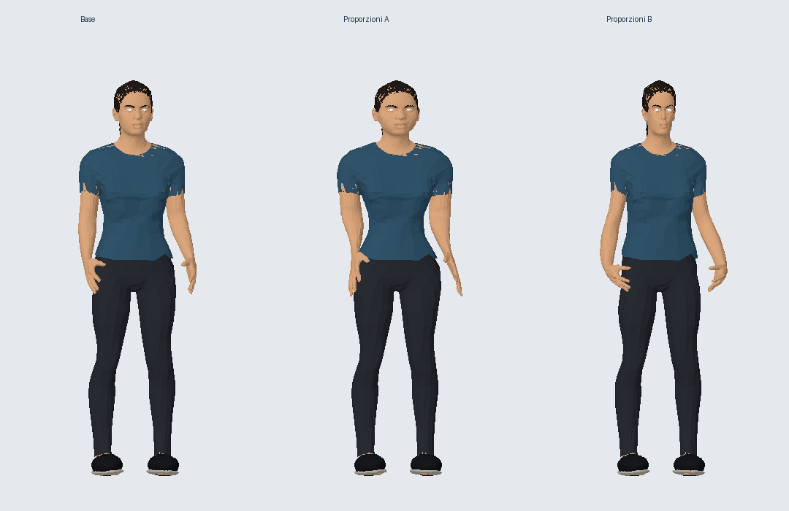
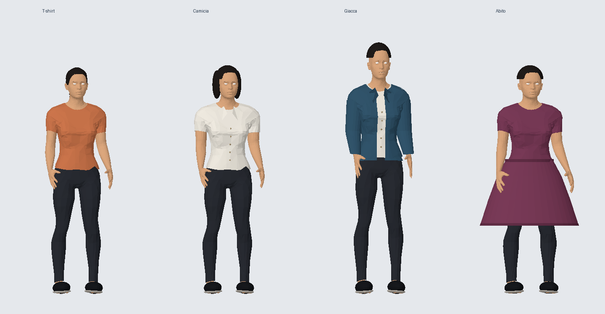
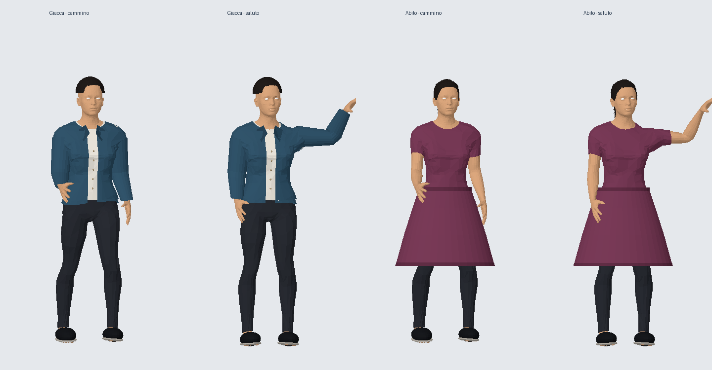

# Avatar upgrade — 23 September 2026

## Implemented

The profile now offers **Essenziale** (procedural avatar) and **Atelier · figura femminile** (authored, skinned MPFB model). Existing profiles remain on Essenziale until changed. Both appear in the preview and invitation rooms. The selector persists through the private social RPC; only the two curated model identifiers are accepted, never user-provided URLs.

Atelier includes a textured human body and outfit, hair color, skin tint, outfit tint, three body widths and four hairstyle settings. Long uses the authored ponytail; other styles use small fitted procedural hair pieces. These are not separate clothing assets or body-shape morphs. The preview provides walking/idle modes, rotation and a face close-up. The A-pose is relaxed before recording animation baselines. Walk cycles and blinks are generated locally.

Both models now support optional round or rectangular eyeglass frames, with black, tortoiseshell or gold finishes. The geometry is generated locally and attached to the head, so it follows head movement in the preview and meetings. Older saved profiles default to no glasses; the private RPC accepts only the enumerated styles and colours. The migration is `infra/avatar-accessories.sql`.

## Asset acquisition and optimization

The earlier binary-download blocker was resolved using a read-only GitHub Actions asset preparation job and the GitHub artifact download connector. The workflow is committed at `.github/workflows/avatar-assets.yml`. No private data or repository write credential is sent to the asset pipeline.

Source: `met4citizen/TalkingHead`, commit `eed58d198076a7e1e825f804802921c4d3804d46`, `avatars/mpfb.glb`. Upstream declares this specific model CC0; other demonstration avatars are excluded. Attribution: `avatars/LICENSE.txt`.

- Original: 36,815,920 bytes.
- Optimized: 1,779,588 bytes, 22,223 triangles, seven skinned meshes.
- Geometry simplified with glTF Transform 4.2.1 and meshoptimizer 0.25.0; essential blink/smile/jaw morphs retained; eyelashes omitted; textures reduced to 1024px WebP.
- Exact asset hash and structure: `avatars/atelier-v1.report.json`.
- Asset tooling dependency lock: `research/avatar-tooling-lock.json`.

## Runtime

`@pixiv/three-vrm` 3.5.5 (MIT) is vendored in `js/avatar-runtime/three-vrm.js` from the official npm package and bundled with GLTFLoader and SkeletonUtils against the existing shared Three.js 0.186.0 engine. No second Three engine or external CDN is loaded. The VRM loader plugin is registered; the included model is **GLB**, not VRM. General user VRM import and VRM expression/animation UI are not implemented.

Atelier loads only when selected or encountered in a room. One cached template shares geometry/textures between participants; each participant gets their own skeleton and tinted materials. The procedural avatar remains visible while loading and on failure; the preview explicitly reports fallback. Requests have a 15-second timeout. Replaced/disposed instances release owned resources without disposing shared texture/geometry data. Preview animation is separate from gallery rendering, capped at about 30 fps and stops when closed/hidden; reduced-motion preference is respected.

When a participant stops walking, interpolation snaps to the final position and the gait settles fully before releasing the gallery render loop. Resting participants do not keep the full gallery rendering continuously; their idle expressions update when the scene next renders.

## Remaining work

CharacterStudio is evaluated and pinned in `research/avatar-sources.json`, but its editor is not integrated. A full Sims-like wardrobe, additional authored bodies, facial sliders, user VRM import, voice/lip sync, distance LODs, and real iPhone/16-user performance measurements remain future work. Do not describe this release as a complete metaverse avatar creator.

## Validation

`npm run check` completed successfully: build validation and 148 tests. Tests verify the exact model hash, size and triangle budget, skeleton presence, independent instances, finite animation transforms, gait settling, eyewear attachment/disposal, profile persistence, invalid value rejection and compatibility with old profiles. Build checks confirm the deployed asset matches the reviewed bytes, licenses are included, and the avatar runtime stays outside initial loading. The `avatar_glasses_and_frames` migration is installed in the dedicated Supabase project; its deployed allowlist and function permissions were verified.

Node model tests omit image decoding and therefore do not validate GPU materials or on-device frame rates. The cloud browser does not support WebGL; final visual rendering and iPhone performance remain to be checked on a real device.

## Studio editor — 24 September 2026

A third renderer option, **Studio · stilizzato**, extends the procedural character with nine bounded proportions (height, shoulders, waist, hips and five facial dimensions), seven hairstyles, four facial-hair choices, separate eye/trouser/shoe colours and jacket/shirt/T-shirt/dress silhouettes. These are generated meshes, not new authored garment assets or a replacement for Atelier. The dress uses a short skirt over the existing legs; clothing has no cloth simulation. Height scales the body vertically without changing the gallery camera/collision capsule.

The editor has four collapsible categories, four starter looks, randomization, a 40-step undo/redo history, eight named device-local looks, and versioned JSON export/import. Look files contain character settings only, never identity or authentication. Invalid values are normalized locally and rejected server-side. The active profile remains cloud-saved through the authenticated RPC; device-local looks are explicitly labelled as local and can be exported manually. A saved profile is propagated through the existing room roster.

Atelier supports height, build, skin/hair/outfit colour, hairstyle and glasses. Facial proportions and the procedural wardrobe are disabled for Atelier and clearly described in the editor. Its authored geometry remains intact. The procedural fallback carries the selected Studio configuration when that renderer is used.

All four avatar source repositories are tracked as pinned research submodules alongside the five optimization sources. They remain excluded from the browser payload. Downloading CharacterStudio and MPFB does not install their editor or Blender; the integrated editor is native to this gallery.

The target GPU/Unreal architecture is recorded in `AVATAR_ENGINE_CONTRACT.md`. Matching The Sims in art quality, authored body diversity, clothing fit, facial detail, animation and device performance remains unfinished. This release is a functional customization editor, not an equivalence claim.

Validation for Studio: `npm run check` passes build and 191 tests in an isolated checkout. New tests exercise every enum and slider endpoint against PostgreSQL, malformed data rejection, history branching, local-storage limits/failures, export/import, finite animated geometry for all 28 garment/hair combinations, and propagation of Studio parameters to another participant through the authorized roster.

## Atelier proportions — 24 September 2026

Atelier now supports the nine body/face controls as well as separate top, trousers and shoe colours. A bounded smooth deformation field operates in the original MPFB bind space. It transforms every affected mesh, facial expression endpoint and skeleton joint consistently. Joint inverse matrices are detached from the cached source before recalculation: a shaped participant cannot alter another participant or the source template. Geometry is cloned only for customized shapes; the original avatar asset remains unchanged.

These controls are geometric deformations, not artist-authored MakeHuman target morphs. The original clothing silhouette remains; two material groups divide top and trousers without creating a draw call per triangle. Lightweight procedural shoes are attached to the feet and follow walking. Hair accessories adjust to face width. General interchangeable authored garments, body bases and physically simulated cloth remain unfinished.

Validation: 196 tests including neutral shared geometry, independent inverse bind matrices, matching bind-pose positions, finite expression/animation data, extreme proportions, sampled positive deformation Jacobians, two-group clothing, attached footwear and idempotent disposal. A CPU geometry review compares default and opposite extreme proportions at rest, without texture decoding or GPU shading. It exposed protruding toes in the first shoe fit, corrected before release. This geometric review does not validate actual materials, mobile GPU performance or all animated clothing intersections.



## Coordinated bodies, garments and motion — 24 September 2026

Five named starting proportions (Equilibrata, Slanciata, Atletica, Morbida, Minuta) can be applied while preserving the current face details, model and outfit. Six complete Atelier looks combine proportions, palette, hair and garments; two stylized looks remain available. These are five parameter configurations of the existing body, not five independently authored anatomical models.

Atelier now supports four distinct garment configurations using original geometry authored for this project:

- T-shirt: the curated source top and trousers.
- Shirt: a fitted collar and buttons added to the source top.
- Jacket: an open fitted shell, long skinned sleeves, collar and contrasting inner shirt. The front opening is clipped geometrically, interpolating joint weights, rather than removing crossing triangles by their centroids.
- Dress: an A-line skirt, belt and hem over the source top and leggings. The skirt follows the hips; there is no cloth simulation.

The generated parts use the existing skeleton and profile garment ID, so they save and appear in meetings through the current validated profile contract. No schema or permission changes were needed. Geometry and materials are owned per avatar and released on replacement. Hair-cap proportions were adjusted during visual review.

Atelier movement now layers alternating stride, knee flexion, ankle counter-rotation, torso rotation, hand motion and a small hip displacement. The greeting blends in/out and adds wrist motion and a slight smile. It settles to the exact recorded rest pose and releases the gallery render loop; no permanent idle animation was added. Preview calls with zero dt can display a static gesture for reduced-motion users. This remains procedural animation, not motion capture, inverse-kinematic foot locking or collision-aware cloth.

Verification: build and 201 tests in an isolated checkout. Dedicated checks exercise all twenty body/garment combinations, finite skinned geometry, a per-avatar triangle ceiling, independent resources, gesture transitions, smile reset, exact rest, and comparable poses at 30/60 fps. CPU z-buffer reviews of wardrobe and moving poses caught a jagged jacket opening, fixed before release. They omit textures, alpha maps, morph rendering and GPU material evaluation; real-device appearance, all-frame intersections and mobile performance remain unverified.

Reproduce the geometry inspection after building vendor modules:

```sh
node tools/review-avatar-geometry.mjs /tmp/ua-wardrobe.json
python tools/raster-avatar-review.py /tmp/ua-wardrobe.json /tmp/ua-wardrobe.png
node tools/review-avatar-geometry.mjs /tmp/ua-motion.json motion
python tools/raster-avatar-review.py /tmp/ua-motion.json /tmp/ua-motion.png
```

The optional Python inspection script requires Pillow and NumPy; neither is used by the deployed site.



